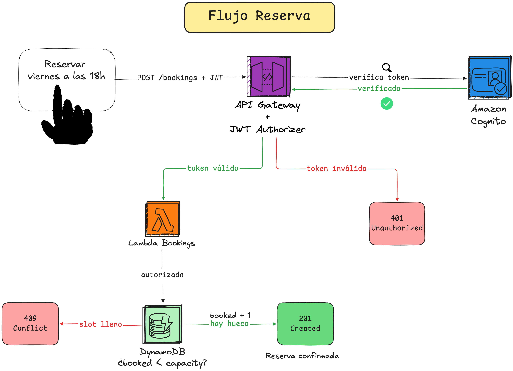
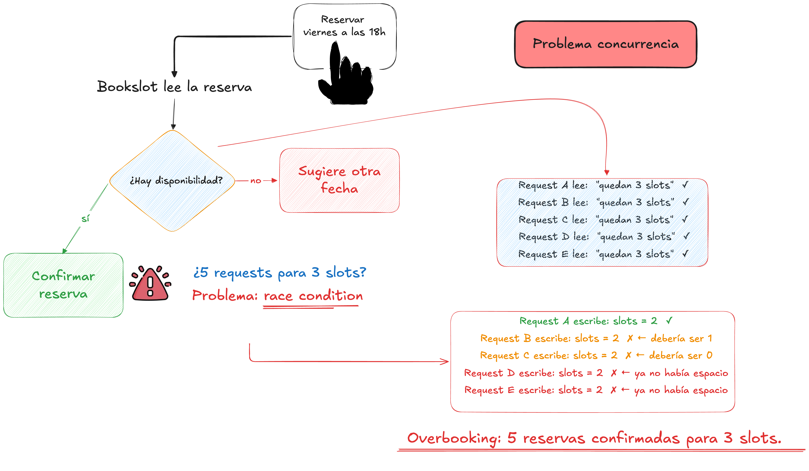
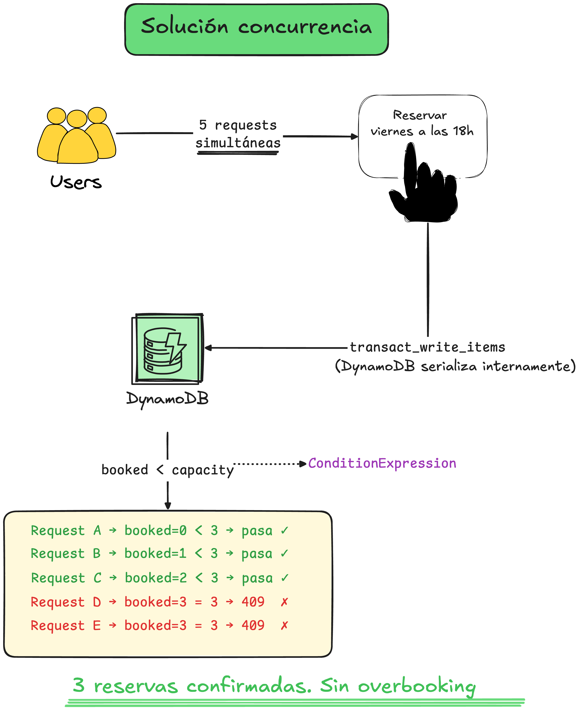
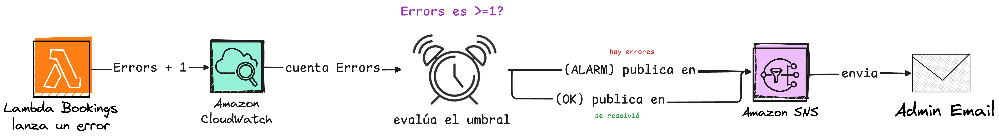

# BookSlot
> 🎓 Proyecto final del curso de AWS impartido por [Commit Academy](https://www.commitacademy.io/)

BookSlot es una API de reservas para recursos con aforo limitado (gimnasios, salas de coworking, etc.). Cada recurso ofrece *slots* (huecos con fecha, hora y capacidad) y los usuarios reservan plazas en ellos.

## Arquitectura

Stack **serverless** (se paga por uso, sin coste en reposo, escalado automático):

- **Cómputo:** AWS Lambda (funciones bajo demanda)
- **API:** API Gateway (HTTP API)
- **Base de datos:** DynamoDB (NoSQL, single-table)
- **Autenticación:** Amazon Cognito (JWT)
- **IaC:** Terraform
- **CI/CD:** GitHub Actions
- **Observabilidad:** CloudWatch (logs + alarmas) + SNS



## Decisiones arquitectónicas (ADRs)

- [ADR-0001: State locking nativo en S3](docs/adr/0001-state-locking-s3-native.md)
- [ADR-0002: Modelo de datos single-table](docs/adr/0002-single-table-design.md)
- [ADR-0003: Rol IAM de ejecución de las Lambdas](docs/adr/0003-lambda-iam-execution-role.md)
- [ADR-0004: Control de concurrencia](docs/adr/0004-concurrency-control.md)
- [ADR-0005: Autenticación del pipeline CI/CD con AWS](docs/adr/0005-cicd-authentication.md)
- [ADR-0006: Bootstrap manual del backend de Terraform](docs/adr/0006-terraform-backend-bootstrap.md)
- [ADR-0007: Autenticación y autorización con AWS Cognito](docs/adr/0007-cognito-authentication-authorization.md)
- [ADR-0008: Observabilidad para reservas](docs/adr/0008-observability-booking-alarm.md)

## Control de concurrencia

El reto central del proyecto es **controlar la concurrencia**, garantizando que un slot nunca acepte más reservas de la capacidad de la que dispone, incluso cuando múltiples usuarios intentan reservar la última plaza **simultáneamente**.

**El problema — race condition:**
El enfoque simple de leer el contador → comprobar → escribir falla bajo 
concurrencia, de modo que, si 5 requests leen "quedan 3 slots" al mismo tiempo, las 5 
confirman la reserva lo que da lugar al **overbooking**.



**La solución — transacción atómica:**
Cada reserva es un `transact_write_items` con dos operaciones que se aplican 
o fallan juntas:
1. `booked += 1` en el slot, **solo si** `booked < capacity` (ConditionExpression).
2. Crear la reserva, **solo si** no existe ya (idempotencia).

DynamoDB serializa internamente las escrituras concurrentes: ante N requests 
simultáneas, solo las que encuentran `booked < capacity` pasan; el resto 
reciben `409`.



**Validación:** `scripts/test-concurrency.sh` lanza 5 reservas en paralelo 
(`xargs -P`) sobre un slot con `capacity: 2`:

## Despliegue

### Prerrequisitos
- Terraform >= 1.14
- AWS CLI configurado (credenciales vía SSO / IAM Identity Center)

### Pasos

1. Ejecutar el script para crear el bucket S3 del tfstate (una sola vez).

```sh
./scripts/bootstrap.sh
```
> Terraform no puede crear el bucket donde guarda su propio estado [ver ADR-0006](docs/adr/0006-terraform-backend-bootstrap.md).

2. Inicializar Terraform: conecta con el backend remoto en S3

```sh
cd infra
terraform init
```

3. Desplegar toda la infraestructura

```sh
terraform apply
```

### Variables

Los valores sensibles o específicos del entorno se definen en `terraform.tfvars` (excluido en `.gitignore`):

```hcl
alarm_email = "email@example.com"   # destino de las alarmas de CloudWatch
```

## Observabilidad

- **Logs:** centralizados automáticamente en CloudWatch Logs (cada Lambda emite su propio flujo).
- **Alarma:** una alarma de CloudWatch vigila la métrica `Errors` de la Lambda `bookings` (la ruta crítica del negocio) y notifica vía **SNS** a un email de administración, tanto al fallar (`ALARM`) como al recuperarse (`OK`).

Razonamiento del diseño: por qué vigilar errores y no tráfico, elección del umbral, patrón pub/sub en el [ADR-0008](docs/adr/0008-observability-booking-alarm.md).



## FinOps

### Tags
Todos los recursos llevan etiquetas (`Project`, `Environment`) aplicados vía `default_tags` en el provider, lo que permite filtrar el gasto por proyecto en Cost Explorer.

### Estimación de coste
Con el tráfico de un MVP, BookSlot opera **dentro del free tier** de AWS:

| Servicio       | Uso estimado (MVP)  | Free tier              | Coste |
|----------------|---------------------|------------------------|-------|
| Lambda         | ~100 req/mes        | 1M req + 400k GB-s/mes | 0 €   |
| DynamoDB       | ~200 ops/mes        | 200M req + 25 GB/mes   | 0 €   |
| API Gateway    | ~100 req/mes        | 1M req/mes             | 0 €   |
| CloudWatch/SNS | volumen mínimo      | dentro de free tier    | ~0 €  |
| S3 (tfstate)   | pocos KB            | —                      | ~0 €  |

**Coste total estimado: ~0 €/mes** — el sistema completo opera dentro del free 
tier con el tráfico real de un MVP académico (~100 req/mes). 

El forecast de **AWS Budgets confirma 0.12$/mes previstos y 0$ gastados**.

>NOTE: Precios verificados en julio de 2026

### Control de gasto
Un AWS Budget (`bookslot-dev-monthly`, límite 10 $/mes) con umbrales escalonados alerta por email ante desviaciones:
- **50%** (5 $) → aviso temprano (gasto real)
- **80%** (8 $) → alerta (gasto real)
- **100%** (10 $) → aviso predictivo (forecast)


## Destrucción

```sh
cd infra
terraform destroy
```

El bucket del `tfstate` se creó fuera de Terraform [ver ADR-0006]((docs/adr/0006-terraform-backend-bootstrap.md)), así que se elimina manualmente. Tiene versionado, así que hay que vaciarlo con `--force`:
```sh
aws s3 rb s3://<BUCKET_TFSTATE> --force
```