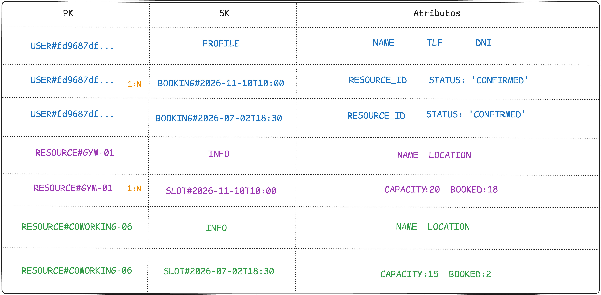

# ADR-0002: Modelo de datos single-table

## Contexto

Al escoger mi arquitectura como **serverless**, esto tiene un **detalle importante a considerar y son las Lambdas**, al ser efímeras, se crean y se destruyen constantemente, por lo que el tipo de base de datos a considerar para trabajar con ellas tenía que tener un enfoque NoSQL, debido a la problemática con el pool de conexiones persistentes.

Una **BBDD relacional depende de conexiones persistentes** y un límite finito de conexiones simultáneas, que se satura cuando cientos de Lambdas intentan conectarse a la vez.

A **DynamoDB**, por el contrario, se accede por llamadas HTTP **sin conexión persistente (abre, consulta, cierra)**, encajando con el modelo serverless escogido.

## Entidades y relaciones

Al venir de bases de datos relacionales, partí de la idea que me era   
familiar, y es, la de detectar entidades del dominio. Por eso tengo cuatro:

- **`USER`** — guarda el perfil del usuario registrado.  
- **`BOOKING`** — guarda las reservas de un usuario.  
- **`RESOURCE`** — guarda los centros donde se ofrecen las actividades que los usuarios reservarán.  
- **`SLOT`** — representa un hueco reservable de un recurso (fecha/hora, capacidad y plazas ocupadas).  
`USER` y `RESOURCE` son las entidades principales (las que abren partición); `BOOKING` cuelga de `USER` y `SLOT` cuelga de `RESOURCE`.

### Relaciones

- `USER 1:N BOOKING` — un usuario tiene muchas reservas.  

- `RESOURCE 1:N SLOT` — un recurso tiene muchos slots.  
- `SLOT 1:N BOOKING` — un slot puede recibir varias reservas hasta agotar su cupo. Esta relación existe en el dominio, pero no la dibujé en el diagrama como filas que cuelguen del slot, ya que el aforo se controla mediante el contador `BOOKED` dentro del propio slot.

## Diseño de claves

Cuando la Lambda consulta una partición, identifica el tipo de cada fila por el prefijo de su SK (`PROFILE`, `INFO`, `SLOT#`, `BOOKING#`), y puede filtrar pidiendo solo las SK que empiezan por un prefijo concreto (por ejemplo, `SLOT#` para traer únicamente los slots de un recurso).

### Identificador de usuario como PK: del DNI al `sub` de Cognito

Por razones prácticas, escogí el **DNI** como PK de usuario durante el 
desarrollo, ya que resultaba fácilmente reconocible a nivel de tabla al ejecutar 
las pruebas (`USER#00000001A`). Un UUID hubiera sido la opción más acertada desde el 
principio, de hecho, es exactamente lo que Cognito emplea para generar el `sub`.

Al integrar **Cognito** descubrí el atributo **`sub`**: un identificador único que 
el proveedor de identidad genera automáticamente para cada usuario. Migré la PK a 
`USER#` por dos motivos:

1. **Garantía del proveedor**: el `sub` lo genera y mantiene Cognito — siempre 
   existe, es único e inmutable por diseño. No depende de que el usuario aporte 
   un dato correcto en el registro, eliminando validaciones innecesarias.

2. **Privacidad**: el `sub` es un identificador anónimo que no expone datos 
   personales. El DNI, en cambio, es un dato sensible que viajaría **legible** en 
   el token — el payload de un JWT va codificado en base64, no cifrado, por lo que 
   cualquiera que lo intercepte podría leerlo. Usar el `sub` como clave evita 
   exponer el DNI en cada petición.

> El DNI no desaparece del sistema: se conserva como atributo dentro del `PROFILE` 
> del usuario en DynamoDB y como atributo custom en Cognito.

## Patrones de acceso

**En DynamoDB se plantean primero los patrones de acceso** (las consultas que se harán), ya que son las que le darán forma a la tabla, por eso he detectado que estas son las que necesito:

- **Reservas de un usuario** → `PK = USER#` + `SK` que empieza por `BOOKING#`→ **Consulta directa**: las reservas cuelgan del propio usuario.

- **Slots de un recurso** → `PK = RESOURCE#<id>` + `SK` que empieza por `SLOT#` → **Consulta directa**: los slots cuelgan del recurso, y al llevar la fecha en la SK salen ordenados cronológicamente.

- **Disponibilidad de un slot** → Sabremos si existen plazas libres con esta operación basado en los atributos: `CAPACITY -  BOOKED`

- **Listar todos los recursos** → no hay una `PK` que los agrupe (cada recurso es su propia partición), así que se resuelve con un **Scan** filtrando las filas de tipo recurso. Es la operación más cara porque recorre toda la tabla en lugar de una sola partición.

Las tres primeras son consultas directas que no requieren índices secundarios, porque en cada caso lo que busco cuelga de la `PK` por la que pregunto.

## Trade-offs

### Lo que gano

- **Encaja de forma natural con serverless**. Al acceder por llamadas HTTP sin conexión persistente, evita el problema del pool de conexiones que sufriría una BBDD relacional con Lambdas.  

- Mis consultas core como las reservas de usuario ó los slots de un recurso son directas y baratas, sin necesidad de índices.  

- El control de overbooking es simple y atómico gracias al contador `BOOKED` en el slot.

### Lo que pierdo / limitaciones

1. **Rigidez ante consultas nuevas**. SQL permite filtrar por cualquier columna sobre la marcha con un `WHERE`; DynamoDB no. Aquí las consultas eficientes se diseñan de antemano a través de las claves, así que un patrón de acceso no previsto obliga a añadir un GSI o a hacer un Scan caro. 
    - Por ejemplo: **Listar todos los recursos**, nos saldría muy caro ya que hace un `SCAN`, pero es una consecuencia asumible y por la curiosidad de evaluar el coste al ser una tabla pequeña.

2. **La query “Reservas de un slot"** no está contemplada en este MVP, ya que quise dejar el diseño lo más sencillo posible, atendiendo a las necesidades principales, pero si en el futuro se necesitara, un panel de administración que muestre los asistentes de un slot, se resolvería añadiendo un GSI.

En definitiva, este diseño está optimizado para los patrones de acceso conocidos del MVP, su precio es la rigidez ante consultas no previstas, algo que sopesé al escoger NoSQL frente a la flexibilidad de SQL.